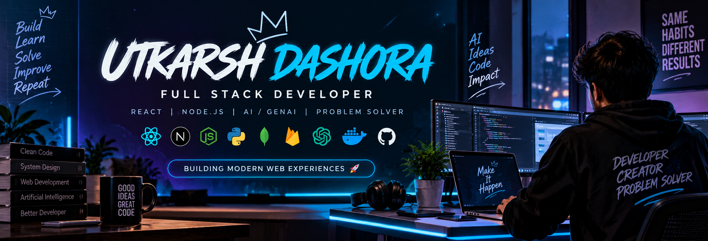

<p align="center">
  
</p>

<h1 align="center">Hi 👋, I'm Utkarsh Dashora</h1>

<h3 align="center">
Full Stack Developer • React Developer • AI/GenAI Enthusiast • Problem Solver
</h3>

<p align="center">
  <a href="https://github.com/UtkarshDashora">
    
  </a>
  <a href="https://github.com/UtkarshDashora">
    
  </a>
</p>

<p align="center">
  
</p>

---

## 👨‍💻 About Me


- 💻 Full Stack Developer focused on modern web applications
- 🎓 Master of Computer Applications (MCA)
- ⚛️ Building applications with React.js, Node.js and Express.js
- 🤖 Exploring Generative AI, LLMs and RAG applications
- 🗄️ Working with MySQL, MongoDB, Supabase and Redis
- 🔐 Interested in authentication, APIs and scalable application architecture
- 🧩 Regularly practicing Data Structures & Algorithms
- 🚀 Passionate about turning ideas into useful products
- 🌱 Continuously learning new technologies

<br clear="right"/>

---

## 🌐 Connect With Me

<p align="center">

<a href="https://github.com/UtkarshDashora">

</a>

<a href="https://linkedin.com/in/utkarsh-dashora">

</a>

<a href="mailto:utkarshdashora@gmail.com">

</a>

<a href="https://utkarshportfolio-958b2.web.app/">

</a>

<a href="https://instagram.com/utkarshdashora">

</a>

<a href="https://wa.me/916265065562">

</a>

</p>

---

# 🛠️ Tech Stack

### 🎨 Frontend

<p>

</p>

### ⚙️ Backend

<p>

</p>

### 🗄️ Databases

<p>

</p>

### 💻 Programming Languages

<p>

</p>

### 🤖 AI / Machine Learning

<p>

</p>

### ☁️ Cloud & DevOps

<p>

</p>

### 🧰 Tools

<p>

</p>

---

# 🚀 Featured Projects

## 🤖 Smart API Generator

> A developer tool that generates REST APIs from database schemas.

**Tech:** React • JavaScript • Supabase • REST API • RBAC

- 🔧 Visual database schema builder
- ⚡ Automatic CRUD API generation
- 🔐 Authentication & authorization
- 👥 Role-Based Access Control
- 📄 OpenAPI specification export

---

## 💰 Price Comparison Tool

> A web application for comparing product prices across multiple e-commerce sources.

**Tech:** React.js • Node.js • Puppeteer • Redis

- 🔎 Product search
- 💰 Price comparison
- 🛒 Multi-marketplace results
- ⚡ Redis caching
- 🤖 Automated web scraping

---

## 🌐 AI Website Builder

> An AI-powered platform for generating modern websites from user requirements.

**Tech:** React • Node.js • JavaScript • AI APIs

- 🤖 AI-assisted website generation
- 🎨 Modern UI generation
- 📱 Responsive website creation
- ⚡ AI-powered development workflow
- 🚀 Deployment-ready applications

---

## 📱 Connectify

> A social networking application with real-time communication.

**Tech:** Flutter • Firebase

- 🔐 Authentication
- 💬 Real-time chat
- 🔔 Push notifications
- 👤 User profiles

---
<h2>🔥 GitHub Streak</h2>

<p align="center">
  
</p>

# 📈 Profile Summary

<p align="center">


</p>

<p align="center">


</p>

<p align="center">


</p>

---
# 📊 GitHub Stats

<p align="center">
  
  
</p>

---

# 🧠 LeetCode

<p align="center">


</p>

---

# 🐍 Contribution Snake

<p align="center">


</p>

---


# 🤖 AI & GenAI

<p align="center">


</p>

<p align="center">

I build AI-powered applications by combining
<b>Generative AI, LLMs, RAG</b> and
<b>modern full-stack technologies</b>.

</p>

```text
🤖 Generative AI
        │
        ├── 🧠 LLM Applications
        │
        ├── 🔎 RAG & Knowledge Retrieval
        │
        ├── ✍️ Prompt Engineering
        │
        ├── 🔌 AI API Integration
        │
        └── 🚀 AI + Full Stack Applications
